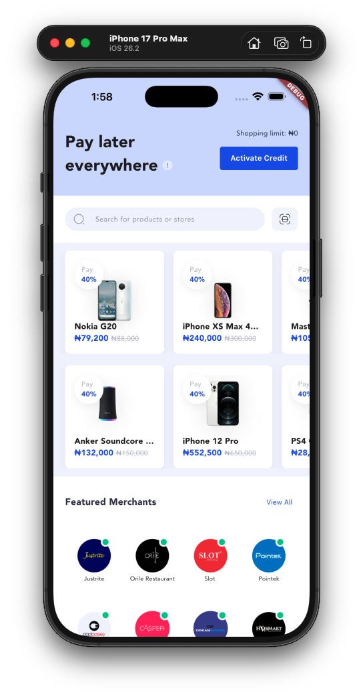
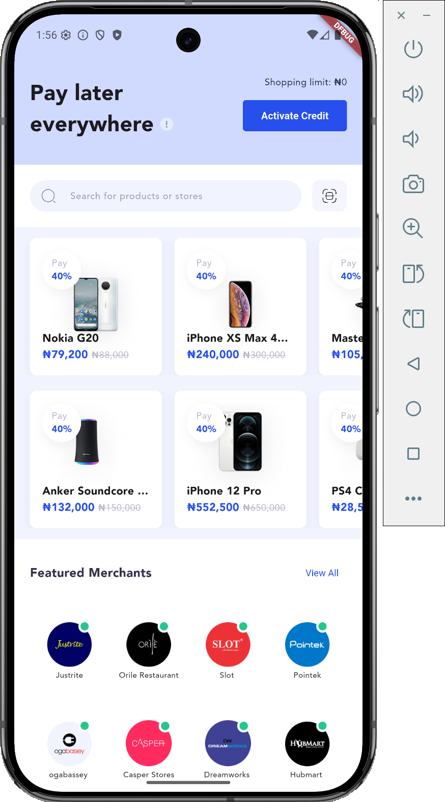

# Credpal Assessment

A Flutter e-commerce application featuring a "Pay Later" service, allowing users to browse products and merchants with flexible payment options.

## Screenshots

### iPhone 17 Pro Max


### Android Emulator


## Prerequisites

Before running this project, ensure you have the following installed:

- **Flutter SDK**: Version 3.10.7 or higher
- **FVM (Flutter Version Management)**: Recommended for managing Flutter versions
- **Dart SDK**: Included with Flutter
- **Android Studio** or **Xcode**: For Android/iOS development
- **An IDE**: VS Code, Android Studio, or IntelliJ IDEA

## Getting Started

### 1. Clone the Repository

```bash
git clone git@github.com:Software78/ubiquitous-spoon.git
cd credpal_assessment
```

### 2. Install Flutter Dependencies

This project uses FVM (Flutter Version Management) for version control. Install dependencies using:

```bash
# Install Flutter dependencies
fvm flutter pub get
```

If you don't have FVM installed, you can use Flutter directly:

```bash
flutter pub get
```

### 3. Run the Application

#### Using FVM (Recommended)

```bash
# Run on iOS Simulator
fvm flutter run

# Run on Android Emulator
fvm flutter run

# Run on a specific device
fvm flutter devices  # List available devices
fvm flutter run -d <device-id>
```

#### Using Flutter Directly

```bash
# Run on iOS Simulator
flutter run

# Run on Android Emulator
flutter run

# Run on a specific device
flutter devices  # List available devices
flutter run -d <device-id>
```

### 4. Build the Application

#### iOS

```bash
# Build for iOS
fvm flutter build ios

# Or with Flutter directly
flutter build ios
```

#### Android

```bash
# Build APK
fvm flutter build apk

# Build App Bundle
fvm flutter build appbundle

# Or with Flutter directly
flutter build apk
flutter build appbundle
```

## Running Tests

The project includes comprehensive responsiveness tests for various mobile screen sizes.

### Run All Tests

```bash
# Using FVM
fvm flutter test

# Using Flutter directly
flutter test
```

### Run Specific Test File

```bash
# Run widget tests
fvm flutter test test/widget_test.dart

# Or with Flutter directly
flutter test test/widget_test.dart
```

### Test Coverage

The test suite includes:
- **Responsiveness Tests**: Tests across 8 modern mobile screen sizes in portrait mode
  - Small Android (360x640)
  - iPhone SE/6/7/8 (375x667)
  - iPhone X/XS/11 Pro (375x812)
  - iPhone 11 Pro Max (414x896)
  - Modern Android variants (360x800, 412x915)
  - iPhone 13 Pro Max (428x926)
  - Large Android (412x892)

## Project Structure

```
credpal_assessment/
├── lib/
│   ├── main.dart          # Main application entry point
│   ├── models.dart        # Data models (Product, Merchant)
│   └── formatter.dart     # Currency formatting utilities
├── assets/
│   ├── fonts/             # Avenir font family
│   ├── icons/             # SVG icons
│   └── images/            # Product and merchant images
├── test/
│   └── widget_test.dart   # Widget and responsiveness tests
└── screenshots/           # Application screenshots
```

## Dependencies

### Main Dependencies

- `flutter_screenutil`: For responsive design and screen size adaptation
- `flutter_svg`: For rendering SVG icons
- `intl`: For internationalization and formatting

### Development Dependencies

- `flutter_test`: For widget testing
- `flutter_lints`: For code linting

## Development Notes

- The app uses `flutter_screenutil` with a design size of 375x812 (iPhone X size)
- All screens are optimized for portrait mode
- The app includes overflow detection in tests to identify responsiveness issues

## Troubleshooting

### Common Issues

1. **FVM not found**: Install FVM using `dart pub global activate fvm`
2. **Dependencies not installing**: Run `flutter clean` then `flutter pub get`
3. **Build errors**: Ensure you have the correct Flutter version (3.10.7+)
4. **Test failures**: Check that all assets are properly configured in `pubspec.yaml`

## License

This project is part of a technical assessment.
